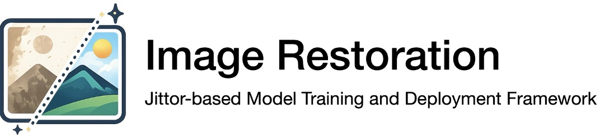

# Jittor-based Image Restoration Framework

<p align="center">
    <br>
    
    <br>
<p>

<p align="center">
  
  
  <a href="https://github.com/PREPONDERANCE/Image-Restoration/pulls">
    
  </a>
  <a href="https://github.com/PREPONDERANCE/Image-Restoration/blob/main/LICENSE">
    
  </a>
  <a href="README.md"></a>
  <a href="README_CN.md"></a>
</p>

## 📖 Table of Contents

- [Introduction](#-introduction)
- [News](#-news)
- [Installation](#%EF%B8%8F-installation)
- [Usage](#-Usage)
- [License](#-License)
- [Citation](#-citation)

## 📝 Introduction

**Image restoration** is a fundamental research area in computer vision and a key enabling technology for improving the practicality and reliability of visual perception systems. In real-world scenarios, the imaging process is often affected by factors such as noise, blur, low resolution, occlusion, and adverse degradation conditions, leading to severe quality degradation in captured images. This significantly limits the performance of downstream vision understanding and analysis tasks. Therefore, high-performance image restoration models must accurately characterize degradation mechanisms and effectively model image structure and texture priors, in order to reconstruct clear, realistic, and detail-rich high-quality images from corrupted observations. However, due to the diversity and uncertainty of image degradation processes, as well as the complex coupling of spatial and semantic information in real-world scenes, achieving robust and highly generalizable image restoration under varying degradation conditions remains one of the core challenges in this field.

The **Jittor-based Image Restoration Framework (JIRF)** is an official framework provided by the CV group at Nankai University. It is built upon the domestically developed high-performance deep learning framework **Jittor**, and supports the training and deployment of image restoration models. Currently, JIRF supports a wide range of advanced image restoration tasks and models, including image denoising, deblurring, super-resolution, and real-world degraded image restoration. Benefiting from Jittor’s efficient compilation and operator optimization mechanisms, models deployed under JIRF can achieve approximately **1.1× to 1.6× inference speedup** compared to PyTorch, providing stable and efficient technical support for downstream applications such as intelligent surveillance image enhancement, low-light image quality improvement, remote sensing image restoration, and industrial visual inspection.

The Jittor deep learning framework offers seamless compatibility with mainstream PyTorch-based models. Taking the [AST](https://openaccess.thecvf.com/content/CVPR2024/papers/Zhou_Adapt_or_Perish_Adaptive_Sparse_Transformer_with_Attentive_Feature_Refinement_CVPR_2024_paper.pdf) architecture as an example, adapting it into JIRF requires modifying only **around ten lines of code**, significantly reducing the migration cost. We sincerely invite more researchers to participate and jointly promote the domestic development of image restoration technologies. Let us work together to build a stronger domestic AI ecosystem.

With the support of the Jittor deep learning framework, this project currently supports the latest works in the image restoration field:

| Work                                                                                                                                                                        | Training                                                                                 | Testing                                                                                |
| --------------------------------------------------------------------------------------------------------------------------------------------------------------------------- | ---------------------------------------------------------------------------------------- | -------------------------------------------------------------------------------------- |
| [ECCV'24 FPro](https://arxiv.org/pdf/2404.00288)                                                                                                                            | [Training Script](https://github.com/PREPONDERANCE/Image-Restoration/blob/main/train.sh) | [Testing Script](https://github.com/PREPONDERANCE/Image-Restoration/blob/main/test.sh) |
| [ICCV'25 HINT](https://arxiv.org/abs/2503.20174)                                                                                                                            | [Training Script](https://github.com/PREPONDERANCE/Image-Restoration/blob/main/train.sh) | [Testing Script](https://github.com/PREPONDERANCE/Image-Restoration/blob/main/test.sh) |
| [CVPR'24 AST](https://openaccess.thecvf.com/content/CVPR2024/papers/Zhou_Adapt_or_Perish_Adaptive_Sparse_Transformer_with_Attentive_Feature_Refinement_CVPR_2024_paper.pdf) | [Training Script](https://github.com/PREPONDERANCE/Image-Restoration/blob/main/train.sh) | [Testing Script](https://github.com/PREPONDERANCE/Image-Restoration/blob/main/test.sh) |
| [TPAMI'25 ASTv2](https://ieeexplore.ieee.org/document/11106710)                                                                                                             | [Training Script](https://github.com/PREPONDERANCE/Image-Restoration/blob/main/train.sh) | [Testing Script](https://github.com/PREPONDERANCE/Image-Restoration/blob/main/test.sh) |

## 🎉 News

- 🎁 **2026.01.17**: Project initialization. This project supports four image restoration tasks, including [FPro](https://arxiv.org/pdf/2404.00288), [HINT](https://arxiv.org/abs/2503.20174), [AST](https://openaccess.thecvf.com/content/CVPR2024/papers/Zhou_Adapt_or_Perish_Adaptive_Sparse_Transformer_with_Attentive_Feature_Refinement_CVPR_2024_paper.pdf), and [ASTv2](https://ieeexplore.ieee.org/document/11106710). Training and testing scripts are provided for all methods.

## 🛠️ Installation

### Pip Installation

```bash
pip install -r requirements.txt
```

### Conda Installation

```bash
conda env create --file="env-jt.yml"
```

## ✨ Usage

### Training

#### Command Line

```sh
sh train.sh Enhancement/Options/HINT_LOL_v2_synthetic.yml
```

- This script requires only one argument: the YML configuration file of the model.
- To use other image restoration models, simply modify this argument to specify the corresponding configuration file, e.g., `Dehaze/Options/RealDehazing_FPro.yml`.

#### Supported Tasks and Models

| Task        | Dataset         | FPro | HINT | AST | ASTv2 |
| ----------- | --------------- | ---- | ---- | --- | ----- |
| Dehazing    | SOTS            | ✅   | ✅   | ❌  | ❌    |
| Moiré       | TIP18           | ✅   | ❌   | ❌  | ❌    |
| Denoising   | BSD68           | ❌   | ✅   | ❌  | ❌    |
| Denoising   | Urban100        | ❌   | ✅   | ❌  | ❌    |
| Deraining   | Rain100L        | ❌   | ✅   | ❌  | ❌    |
| Deraining   | SPAD            | ✅   | ❌   | ❌  | ❌    |
| Deraining   | AGAN            | ✅   | ❌   | ❌  | ❌    |
| Desnowing   | Snow100K        | ❌   | ✅   | ❌  | ✅    |
| Low-light   | LOLv2 Real      | ❌   | ✅   | ❌  | ❌    |
| Low-light   | LOLv2 Synthetic | ❌   | ✅   | ✅  | ✅    |
| Motion Blur | GoPro           | ✅   | ❌   | ❌  | ✅    |
| Motion Blur | RealBlur-J      | ✅   | ❌   | ❌  | ✅    |
| Motion Blur | RealBlur-R      | ✅   | ❌   | ❌  | ✅    |

---

### Testing

#### Command Line

```sh
sh test.sh
```

- This script requires no arguments. All testing commands are predefined within the script.
- When using this script, please modify the testing parameters as needed. The parameter descriptions are as follows.

#### Parameter Description

- `--opt`: Path to the model configuration file, e.g., `Enhancement/Options/AST_LOL_v2_synthetic.yml`
- `--result_dir`: Directory to save restored images
- `--weights`: Path to the model weights
- `--gpus`: GPUs used for testing (a wrapper for `CUDA_VISIBLE_DEVICES`)
- `--gt_dir`: Directory of ground-truth images
- `--input_dir`: Optional directory for degraded input images. In most cases, the input directory is specified in the opt file. Some scripts explicitly require this argument—please refer to the script for details.

#### Supported Tasks and Models

| Task      | Dataset         | FPro | HINT | AST | ASTv2 |
| --------- | --------------- | ---- | ---- | --- | ----- |
| Dehazing  | SOTS            | ✅   | ✅   | ❌  | ❌    |
| Low-light | LOLv2 Real      | ❌   | ✅   | ❌  | ❌    |
| Low-light | LOLv2 Synthetic | ❌   | ✅   | ✅  | ✅    |

#### Custom Testing

All testing scripts support the parameters listed above (except `input_dir`). If you need to perform custom testing, please follow the existing scripts and modify the corresponding hyperparameters accordingly.

## 🏛 License

This framework is released under the [Apache License (Version 2.0)](https://github.com/modelscope/modelscope/blob/master/LICENSE). Please refer to the original resource pages for model and dataset licenses and comply with their respective terms.

## 📎 Citation

```bibtex
@inproceedings{zhou_TPAMI25_astv2,
  title={Learning An Adaptive Sparse Transformer for Efficient Image Restoration},
  author={Zhou, Shihao and Pan, Jinshan and Yang, Jufeng},
  booktitle={TPAMI},
  year={2025}
}
```

```bibtex
@inproceedings{zhou_ICCV25_HINT,
  title={Devil is in the Uniformity: Exploring Diverse Learners within Transformer for Image Restoration},
  author={Zhou, Shihao and Li, Dayu and Pan, Jinshan and Zhou, Juncheng and Shi, Jinglei and Yang, Jufeng},
  booktitle={ICCV},
  year={2025}
}
```

```bibtex
@inproceedings{zhou_ECCV2024_FPro,
  title={Seeing the Unseen: A Frequency Prompt Guided Transformer for Image Restoration},
  author={Zhou, Shihao and Pan, Jinshan and Shi, Jinglei and Chen, Duosheng and Qu, Lishen and Yang, Jufeng},
  booktitle={ECCV},
  year={2024}
}
```

```bibtex
@inproceedings{zhou2024AST,
  title={Adapt or Perish: Adaptive Sparse Transformer with Attentive Feature Refinement for Image Restoration},
  author={Zhou, Shihao and Chen, Duosheng and Pan, Jinshan and Shi, Jinglei and Yang, Jufeng},
  booktitle={CVPR},
  year={2024}
}
```
